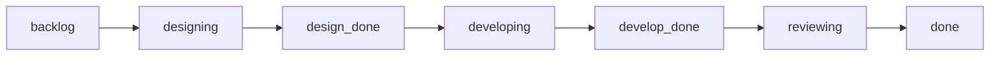
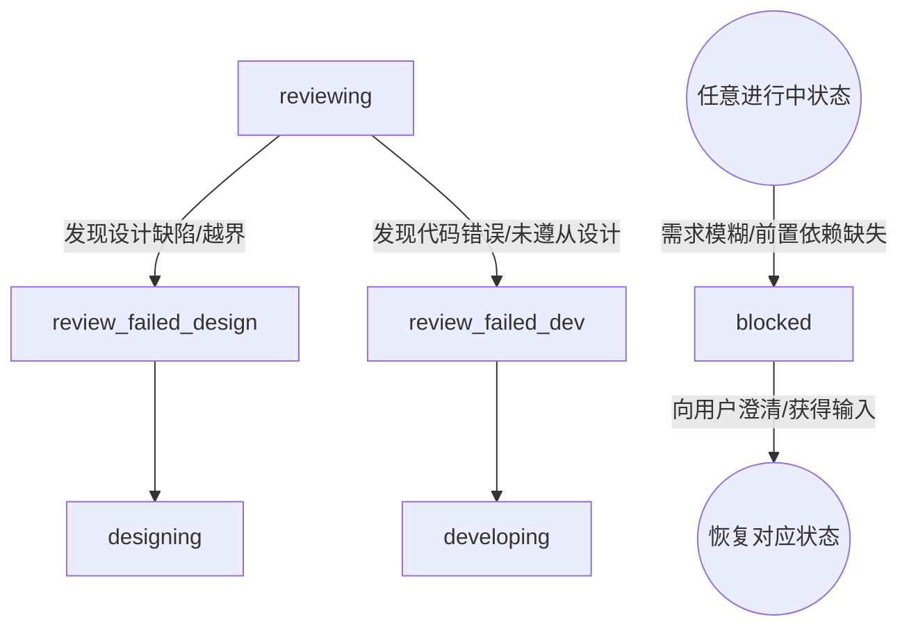

# 市场洞察 AI 智能体系统 — 任务项协作流程文档

> **文档版本**: v1.0  
> **创建日期**: 2026-05-14  
> **最后更新**: 2026-05-14  
> **状态**: 维护中  
> **关联文档**: [PRD](./prd.md) | [架构文档](./architecture.md) | [技术栈文档](./tech.md) | [分步计划](./plan.md)

---

## 1. 文档目的

本文档统一说明 `/docs/agents` 下三类 Agent 在处理单个任务项时的协作流程，用于回答以下问题：

- 一个任务项如何从“收到任务”推进到“最终完成”
- 三类 Agent 各自负责什么、何时接手、何时交接
- 正常情况、返工情况、升级情况如何处理
- `plan.md`、`process.md`、设计方案、实现结果、审阅结论之间如何衔接

本文档是**任务项级协作规约**，不替代 `plan.md` 的排期与任务拆分，也不替代 `process.md` 的实时状态记录。

---

## 2. 参与角色

| 角色 | 对应文件 | 核心职责 | 工作粒度 |
|------|------|------|------|
| 设计 Agent | [task-designer.md](./agents/task-designer.md) | 将任务转为可执行技术方案，并维护模块级简略共享上下文 | 任务项级 |
| 开发 Agent | [task-developer.md](./agents/task-developer.md) | 按设计方案实现代码并自测 | 任务项级 |
| 审阅 Agent | [task-gatekeeper-reviewer.md](./agents/task-gatekeeper-reviewer.md) | 审查需求、设计、代码与风险 | 任务项级 |

---

## 3. 依赖文档分工

| 文档 | 用途 | 在流程中的角色 |
|------|------|------|
| `prd.md` | 业务目标、范围、验收基线 | 判断“做得对不对” |
| `architecture.md` | 模块边界、流程、约束 | 判断“方案是否合理” |
| `tech.md` | 技术选型、版本、工程规范 | 判断“实现是否符合约定” |
| `plan.md` | 任务拆分、依赖、状态框架 | 判断“当前任务是什么、先后顺序如何” |
| `process.md` | 当前任务实时推进记录 | 判断“当前做到哪里、下一步谁接手” |

---

## 4. 标准主流程

本节按照状态机的合法流转（即 `process.md` 中的 `状态`）来描述任务项的协作全生命周期。

## 4.1 正常状态流转（一次通过）



| 状态节点 | 核心动作 | 责任角色 |
|---|---|---|
| `backlog` | 任务在 plan.md 中已排期，但尚未开始。 | - |
| `designing` | 检查需求与上下文，出具具体的技术实现方案。 | 设计 Agent |
| `design_done` | 设计方案完成，记录于 process.md，等待开发。 | 设计 Agent |
| `developing` | 基于设计方案，执行 TDD 开发流程并完成自测。 | 开发 Agent |
| `develop_done`| 代码实现与测试均已完成，等待审阅。 | 开发 Agent |
| `reviewing` | 依据四大维度（需求、设计、代码、风险）进行审查。 | 审阅 Agent |
| `done` | 审查通过，任务项完成闭环。 | 审阅 Agent |

## 4.2 异常状态流转（返工与阻塞）

当推进过程中遇到不符合预期的情况时，将偏离主流程进入异常流转分支。



### 异常流转规则：

1. **设计问题返工 (`review_failed_design`)**
   - **流转路径**: `reviewing` -> `review_failed_design` -> `designing` -> `design_done` -> `developing` -> `develop_done` -> `reviewing`
   - **执行逻辑**: 审阅时发现架构不合理或需求覆盖有遗漏，将任务打回给**设计 Agent** 重新修改方案。方案修正后，**开发 Agent** 必须基于新方案重写或修改代码。

2. **开发问题返工 (`review_failed_dev`)**
   - **流转路径**: `reviewing` -> `review_failed_dev` -> `developing` -> `develop_done` -> `reviewing`
   - **执行逻辑**: 设计方案没有问题，但代码实现存在 Bug、未覆盖边界情况或未严格遵守设计方案。此时直接打回给**开发 Agent** 进行修复。

3. **需求问题与阻塞 (`blocked`)**
   - **流转路径**: 遭遇外部障碍 -> `blocked` -> 暂停并向用户提问 -> 获得答复 -> 继续 `designing` 或 `developing`
   - **执行逻辑**: 若 `prd.md` 定义不清或出现不可解决的技术冲突，Agent 无法自行决策，必须通过 `blocked` 状态暂停执行，等待人类用户的明确答复后再恢复工作。

---

## 5. 各阶段详细规则

## 5.1 设计阶段

### 5.1.1 进入条件

- 当前任务项尚无可执行技术方案
- 或审阅结论判定为“设计问题”

### 5.1.2 输入

- `prd.md`
- `tech.md`
- `architecture.md`
- `plan.md`
- `process.md`（如存在）
- 审阅反馈（返工场景）

### 5.1.3 输出

- 任务项级设计方案（首次或返工）
- 必要时同步 `plan.md` 中的模块简略方案与任务项关联关系
- `process.md` 中的设计记录与状态更新

### 5.1.4 设计阶段规则

- 设计始终按**任务项级**进行。
- 为避免忽略跨任务关联，设计时必须同时检查并维护 `plan.md` 中所属模块的**简略技术方案**与**任务项关联关系**。
- `plan.md` 中的模块级信息只保留共享上下文，不代替任务项级执行设计。
- 设计必须显式覆盖：
  - 所属模块上下文
  - 架构定位
  - 组件分解
  - 数据流
  - 接口定义
  - 错误处理
  - 边界情况
  - 测试策略
  - 任务项实现细案

### 5.1.5 设计完成判定

- 任务项验收标准均有映射实现路径
- 不违反 `prd.md`、`architecture.md`、`tech.md`
- 接口和输入输出足够具体，开发无需二次猜测
- `process.md` 已更新为设计完成状态

---

## 5.2 开发阶段

### 5.2.1 进入条件

- 已存在当前任务项的可执行设计方案
- 或审阅结论判定为“开发问题”

### 5.2.2 输入

- `prd.md`
- `tech.md`
- `architecture.md`
- `plan.md`
- `process.md` 中当前任务项的设计与执行信息
- 审阅反馈（返工场景）

### 5.2.3 输出

- 代码实现
- 测试实现与执行结果
- `process.md` 中的开发记录（需包含精确改动锚点与 TDD 物理凭证）与状态更新

### 5.2.4 开发阶段规则

- 只处理当前任务项，不主动扩展到其他任务或模块。
- 必须遵循 TDD：
  - Red：先写失败测试
  - Green：写最小实现
  - Refactor：在测试通过后整理结构
- 实现必须严格遵循已批准设计，不得擅自偏离。
- 每次重要进展后应更新 `process.md`，并在文档中提供精确的**改动范围锚点**（类名/函数名/行号）与测试通过的**终端日志物理凭证**。

### 5.2.5 开发完成判定

- 测试通过
- 当前任务项验收标准已覆盖
- 关键边界情况已处理
- `process.md` 已记录修改文件、改动内容、当前状态

---

## 5.3 审阅阶段

### 5.3.1 进入条件

- 开发 Agent 已完成当前任务项实现
- `process.md` 已处于待审阅状态

### 5.3.2 输入

- `prd.md`
- `tech.md`
- `architecture.md`
- `plan.md`
- `process.md`
- 当前实现产物

### 5.3.3 输出

- 审阅结论：通过 / 不通过
- 不通过时必须在 `process.md` 中输出精确的**结构化缺陷报告**（文件 -> 定位 -> 缺陷 -> 期望结果）。
- `process.md` 中的审阅记录、返工计数、下一步责任人

### 5.3.4 审阅四大维度

1. 需求合规性  
   对照 `plan.md` 与 `prd.md`，检查所有验收标准是否满足。

2. 设计与架构合规性  
   对照 `process.md` 中方案、`plan.md` 中模块简略方案与 `architecture.md`，检查实现是否越界、违背模块边界或错误使用流程。

3. 代码质量  
   对照 `tech.md`，检查可读性、可维护性、错误处理、日志、结构与命名。

4. 风险评估  
   检查是否引入安全、性能、回归、部署、迁移或数据风险。

### 5.3.5 审阅完成判定

- 四个维度无阻塞问题则通过
- 有阻塞问题则不通过，并明确分类

---

## 6. 异常与返工流程

## 6.1 失败类型定义

| 类型 | 含义 | 下一步 |
|------|------|------|
| 设计问题 | 方案本身不成立、不完整、与架构冲突 | 回到设计 Agent |
| 开发问题 | 实现错误、不完整、未按方案执行 | 回到开发 Agent |
| 需求问题 | 需求模糊、冲突、不可验证 | 暂停并澄清需求 |

## 6.2 返工分支

### 6.2.1 设计问题返工

流程为：

`设计微调 -> 开发重做 -> 审阅复查`

规则：

- 只允许修改失败任务项的方案
- 若失败暴露的是共享假设问题，只允许最小范围同步 `plan.md` 中对应模块的简略方案或任务关联，不允许借返工之名重写整个模块方案
- 必须在 `process.md` 里记录“因何失败、如何修正”

### 6.2.2 开发问题返工

流程为：

`开发返工 -> 审阅复查`

规则：

- 开发 Agent 必须针对 reviewer 的问题逐条修复
- 不允许只修表象、不修根因
- 必须在 `process.md` 中补充“修了什么、为何修”

### 6.2.3 需求问题处理

流程为：

`暂停执行 -> 向用户澄清 -> 视情况回设计或回开发`

规则：

- 未澄清前不得继续推进
- 如澄清影响设计边界，应先回设计阶段
- 如澄清只影响实现细节，可直接回开发阶段

### 6.2.4 交叉问题处理

若审阅同时发现设计问题与开发问题：

1. 先处理设计问题
2. 再重新开发
3. 最后重新审阅

不得跳过设计修正直接改代码。

---

## 7. 升级与终止条件

## 7.1 必须暂停并澄清的情况

- 当前任务项身份不明确
- `plan.md` 与实际任务描述不一致
- 验收标准模糊或不可测试
- 设计方案与 `tech.md` / `architecture.md` 冲突
- 开发说明不足以判断实现内容
- 基础文档缺失或不可读

## 7.2 必须升级给用户的情况

- 单个任务项返工达到 5 次
- 证明在现有 `prd.md` / `architecture.md` / `tech.md` 约束下无法完成任务
- 任务范围明显超出当前 `plan.md`
- 设计返工需要改变模块级边界，而不仅是任务项微调

---

## 8. 状态机建议

## 8.1 推荐状态

| 状态 | 说明 |
|------|------|
| `backlog` | 未开始 |
| `designing` | 设计中 |
| `design_done` | 设计完成，待开发 |
| `developing` | 开发中 |
| `develop_done` | 开发完成，待审阅 |
| `reviewing` | 审阅中 |
| `review_failed_design` | 审阅失败，设计问题 |
| `review_failed_dev` | 审阅失败，开发问题 |
| `blocked` | 阻塞中 |
| `done` | 已完成 |

## 8.2 合法流转

```text
backlog -> designing -> design_done -> developing -> develop_done -> reviewing -> done

reviewing -> review_failed_design -> designing -> design_done -> developing -> develop_done  -> reviewing

reviewing -> review_failed_dev -> developing -> develop_done  -> reviewing

任意状态 -> blocked
blocked -> designing / developing / reviewing
```

---

## 9. process.md 的最低要求

三类 Agent 的规则都依赖 `process.md`，因此建议该文件至少包含以下四个部分：

1. 当前战场  
   当前处理的是哪个任务项，由哪个 Agent 接手，状态是什么。

2. 模块上下文引用  
   当前任务所属模块的简略方案、任务项关联关系，来源于 `plan.md`，在 `process.md` 中只做必要摘录或引用。

3. 任务项列表  
   每个任务项的状态、执行链、返工次数。

4. 执行所需信息  
   设计方案、开发改动、审阅意见等供下一角色接手的信息。

如果缺少 `process.md`，建议基于 [process_template.md](./templates/process_template.md) 初始化，而不是临时自由发挥。

---

## 10. 典型场景示例

## 10.1 首次成功通过

```text
状态流转: backlog -> designing -> design_done -> developing -> develop_done -> reviewing -> done
执行说明: 设计 Agent 产出方案 -> 开发 Agent 完成实现与测试 -> 审阅 Agent 通过 -> 完成
```

## 10.2 因设计问题返工一次

```text
状态流转: backlog -> designing -> design_done -> developing -> develop_done -> reviewing -> review_failed_design -> designing -> design_done -> developing -> develop_done -> reviewing -> done
执行说明: 设计出方案 -> 开发实现 -> 审阅发现方案边界有误 -> 驳回设计微调方案 -> 开发重新实现 -> 审阅通过 -> 完成
```

## 10.3 因开发问题返工一次

```text
状态流转: backlog -> designing -> design_done -> developing -> develop_done -> reviewing -> review_failed_dev -> developing -> develop_done -> reviewing -> done
执行说明: 已有设计 -> 开发实现 -> 审阅发现异常处理不完整 -> 驳回开发修复 -> 审阅通过 -> 完成
```

## 10.4 因需求不清暂停

```text
状态流转: backlog -> designing (或 reviewing 等) -> blocked -> designing (或 developing 等)
执行说明: 设计/审阅阶段发现需求不明确 -> 标记阻塞并暂停 -> 向用户澄清 -> 澄清后恢复相应状态继续
```

---

## 11. 执行纪律

- **严禁凭空捏造任务 (白名单制)**: `plan.md` 是唯一合法的任务源。任何 Agent 绝对禁止生成、扩展、臆想或执行 `plan.md` 任务清单中未显式定义的 Step X。
- **严格串行依赖拦截**: 任何任务开始前，必须核对 `plan.md` 中定义的“前置依赖”。若存在依赖项且该依赖项状态非 `done`，则该任务立即进入 `blocked`，严禁跨级跳步执行。
- 不得跳过设计直接开发未定义任务
- 不得跳过审阅直接标记完成
- 不得把设计问题伪装成开发问题处理
- 不得在返工时擅自扩大范围
- 所有状态流转必须可在 `process.md` 中追踪

---

> **文档维护者**: 协作流程设计者 / 审阅 Agent  
> **使用建议**: 将本文档作为三类 Agent 的统一流程说明，并与 `process.md` 搭配使用
